# Open Movie Tracker

A privacy-first, open-source movie and TV show tracking app for Android.


---

## Screenshots

<p align="center">
  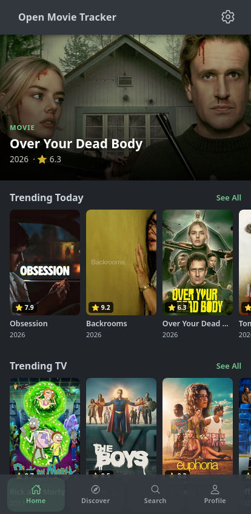
  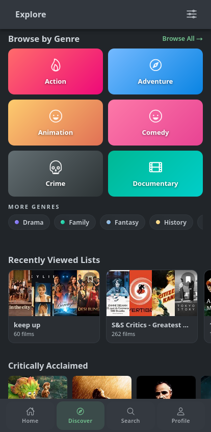
  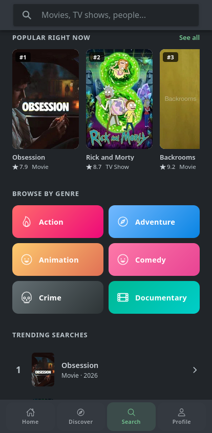
  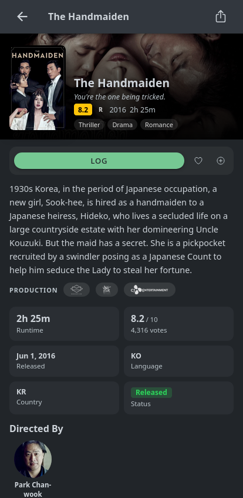
  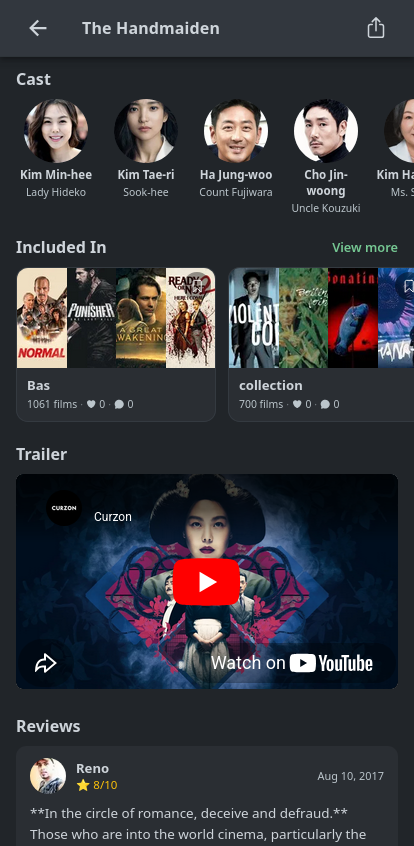
</p>
<p align="center">
  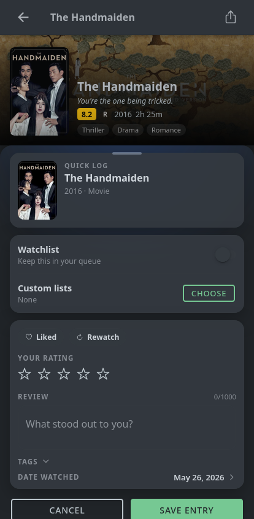
  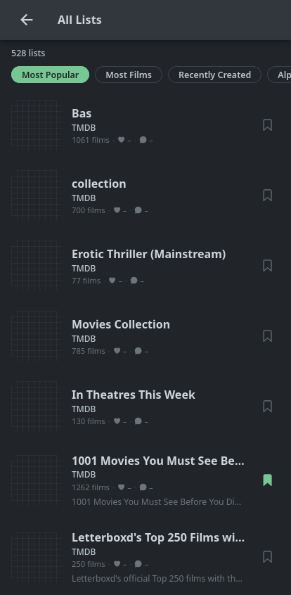
  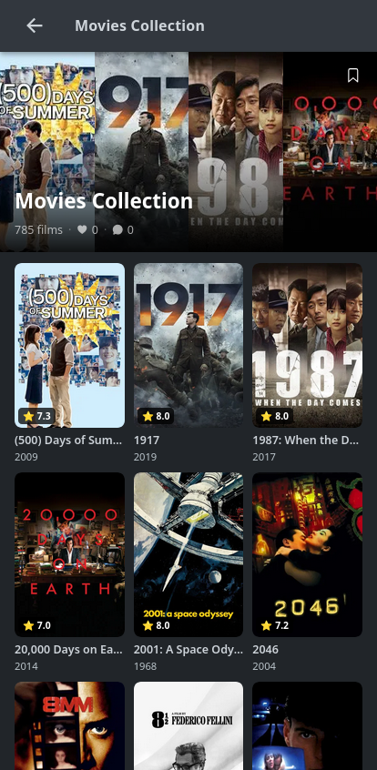
  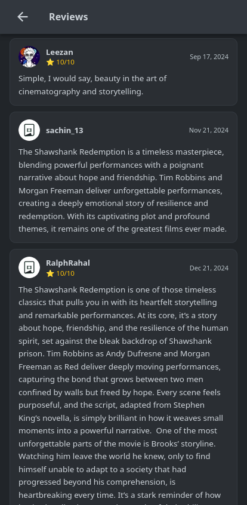
  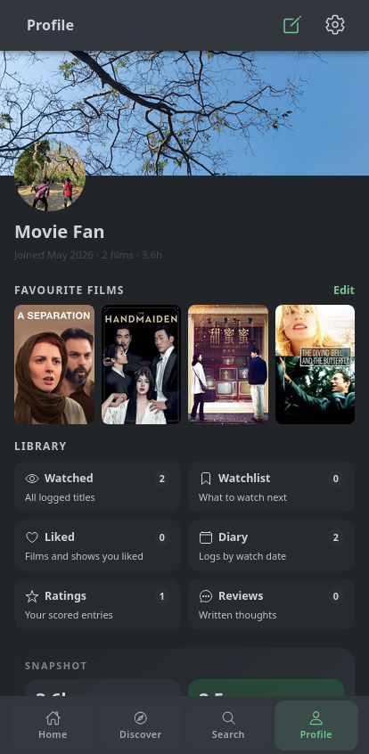
</p>
<p align="center">
  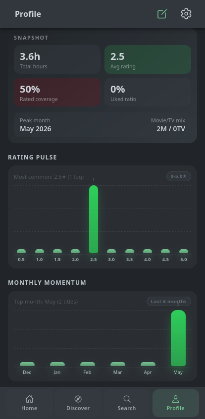
</p>

| # | Screenshot | Description |
|---|-----------|-------------|
| 1 | `home_screen` | Home tab — trending hero banner, popular/now playing/upcoming movie rows, and popular/airing TV show carousels |
| 2 | `explore_screen` | Discover tab in Browse mode — filter movies and TV by genre, year, sort order, and rating |
| 3 | `search_screen` | Search tab — debounced multi-type search (movies, TV, people), recent searches list, trending suggestions |
| 4 | `movie_screen` | Movie detail page — poster, backdrop slideshow, overview, cast, trailers, similar/recommended |
| 5 | `movie_screen_meta_information` | Movie detail — scroll down to show content rating, runtime, release status, genres, and director |
| 6 | `movie_logging` | Log bottom sheet — rate (0.5–5.0 stars), mark liked/rewatch, write a review, add tags, pick a date, manage watchlist and custom lists |
| 7 | `movie_in_lists_screen` | TMDB lists for a movie — paginated community lists with bookmarking and sort options |
| 8 | `custom_list_screen` | Custom user-created list detail — items with poster, title, and year |
| 9 | `reviews_screen` | TMDB critic reviews — searchable, sortable (newest/oldest/highest/lowest rating) |
| 10 | `profile_screen` | Profile tab — stats overview (watched count, hours, avg rating), quick links (watched, watchlist, liked, diary, ratings, reviews), up to 4 pinned favorites, custom lists, and activity feed |
| 11 | `profile_analytics` | Profile stats dashboard — rating distribution chart, 6-month momentum, top genres bar chart, movie/TV mix |

---

## About

Open Movie Tracker is a free, open-source Android app for discovering and tracking movies and TV shows — a privacy-first alternative to apps like Letterboxd. No account or sign-in is required; all your data — watched history, ratings, reviews, watchlist, favorites, custom lists, and profile settings — is stored **locally on your device**. The app supports both movies **and** TV shows, including season and episode-level tracking. All metadata is sourced from [The Movie Database (TMDb)](https://www.themoviedb.org/).

---

## Features

### 🎬 Movies & TV Shows
- [x] Browse trending movies and TV shows (daily/weekly)
- [x] View popular, top rated, now playing, and upcoming movies
- [x] View popular, top rated, airing today, and on-air TV shows
- [x] Full movie detail page: overview, backdrop slideshow, cast, trailers, release dates, runtime, content rating, genres, status, director
- [x] Full TV show detail page: overview, backdrop slideshow, cast, trailers, seasons (with episode-level tracking), content rating, creators, status

### 🔍 Discovery & Search
- [x] Multi-type search (movies, TV shows, people) with debounced input
- [x] Discover page with Explore, Browse (filterable by genre, year, sort, rating), and TMDB Lists modes
- [x] Recent search history (last 10)
- [x] Browse and bookmark community lists from TMDb
- [x] Explore movies and TV by person — full filmography with combined credits

### 📋 Lists & Tracking
- [x] Watchlist — add/remove movies and TV shows
- [x] Favorites — pin up to 4 favorites on your profile, reorder and manage
- [x] Watched log — comprehensive tracking with rating, review, tags, rewatch, liked, and date
- [x] Custom user-created lists — create, name, describe, delete, and manage items
- [x] Liked entries — mark individual watched entries as liked
- [x] Episode-level watched tracking — toggle individual episodes or mark whole seasons

### 📝 Logging
- [x] Rate movies and TV shows on a 0.5–5.0 star scale (0.5 increments)
- [x] Write and store reviews per entry
- [x] Log watch date (date picker)
- [x] Add custom tags to watched entries
- [x] Mark entries as rewatch
- [x] Full log bottom sheet accessible from any movie card, poster, or detail page (long-press or action menu)

### 📊 Profile & Analytics
- [x] Stats dashboard: total watched count, total hours estimated, average rating, total liked
- [x] Rating distribution chart (0.5–5.0 in 0.5 increments)
- [x] 6-month momentum chart
- [x] Top genres bar chart (from tags)
- [x] Movie/TV mix breakdown
- [x] Chronological diary (grouped by month/year)
- [x] Activity feed with paginated history
- [x] Filterable watched/watchlist/liked/ratings/reviews pages (all/movies/TV tabs, search, sort)

### 🎨 Personalization
- [x] Theme selection: system, light, or dark
- [x] Primary color: green or red
- [x] Language and region settings (affects TMDb results)
- [x] Safe search toggle (exclude adult content)
- [x] Fade watched toggle — visually dim watched items
- [x] Language blocking — filter out content in specific languages
- [x] Default media tab preference (movies or TV)
- [x] Edit profile: display name, bio, avatar, and cover image

### 🔒 Privacy
- [x] No account or sign-in required
- [x] All data stored locally on device using `localStorage`
- [x] No tracking, no analytics, no crash reporters
- [x] Only network calls are to the TMDb API
- [x] Export/import your full data as JSON in settings
- [x] Clear watch log or all data with confirmation

---

## Tech Stack

| Layer | Technology |
|-------|-----------|
| Framework | Ionic 8 + Angular 21 |
| Native | Capacitor 8 |
| Language | TypeScript ~5.9 |
| Styling | SCSS + Ionic Components + Tailwind CSS |
| Data Source | TMDb API v3 |
| Local Storage | `localStorage` (via `UserDataService` with keys prefixed `mva_`) |
| Build | Gradle + Android SDK |
| CI/CD | GitHub Actions |
| Release | release-please + signed APK |

---

## Getting Started

### Prerequisites

- Node.js (LTS, 18+)
- npm (or pnpm — the project uses a pnpm lockfile)
- Android Studio (for building and running on Android)
- JDK 17+ (for Android builds)
- A TMDb API key (free — [register here](https://www.themoviedb.org/settings/api))

### Clone & Install

```bash
git clone https://github.com/r-shafi/open-movie-tracker.git
cd open-movie-tracker
pnpm install
```

### TMDb API Key Setup

1. Get an API key from [https://www.themoviedb.org/settings/api](https://www.themoviedb.org/settings/api)
2. Open `src/environments/environment.ts` and `src/environments/environment.prod.ts`
3. Replace the `tmdbApiKey` value with your key:

```typescript
export const environment = {
  production: false,
  tmdbApiKey: 'your_api_key_here',
  tmdbBaseUrl: 'https://api.themoviedb.org/3',
  tmdbImageBase: 'https://image.tmdb.org/t/p',
};
```

> The development and production files share the same TMDb API key. Both must be updated.

### Run in Browser

```bash
npm run start
# or: ionic serve
```

Opens at `http://localhost:8100`. Note: Capacitor plugins (network, haptics, etc.) may not work in the browser — the app falls back gracefully.

### Run on Android

```bash
npm run build
npx cap sync android
npx cap open android
```

Then click **Run** in Android Studio.

---

## Project Structure

```
src/
├── app/
│   ├── pages/
│   │   ├── home/              # Home tab — trending hero banner + media carousels
│   │   ├── discover/          # Discover tab — explore, browse (genre/year/rating filters), TMDB lists
│   │   ├── search/            # Search tab — multi-type search with recent history
│   │   ├── film/              # Movie detail — overview, cast, trailers, backdrop slideshow
│   │   ├── tv/                # TV show detail — overview, seasons, cast, trailers
│   │   ├── tv-season/         # TV season detail — episode list with watched tracking
│   │   ├── person/            # Person detail — biography, filmography, photos, social links
│   │   ├── reviews/           # TMDB critic reviews — searchable, sortable
│   │   ├── settings/          # Settings — theme, language, region, data export/import
│   │   ├── film-lists/        # TMDB lists for a specific movie
│   │   ├── tv-lists/          # TMDB lists for a specific TV show
│   │   ├── list-detail/       # TMDB list detail — items with bookmarking
│   │   ├── movies/            # Stub page (superseded by Home tab)
│   │   ├── tabs/              # Bottom tab navigation (Home, Discover, Search, Profile)
│   │   └── profile/           # Profile tab — stats, favorites, lists, activity
│   │       ├── watched/       # Filterable/sortable watched history
│   │       ├── watchlist/     # Watchlist manager (all/movies/TV)
│   │       ├── diary/         # Chronological diary grouped by month/year
│   │       ├── favorite/      # Favorites manager (up to 4)
│   │       ├── liked/         # Liked entries (searchable, filterable)
│   │       ├── ratings/       # All rated entries (sortable)
│   │       └── user-reviews/  # All entries with written reviews (searchable)
│   ├── components/
│   │   ├── edit-profile/      # Modal to edit display name, bio, avatar, cover
│   │   └── add-favorite-modal/ # Search modal to add favorites
│   ├── services/
│   │   ├── tmdb.service.ts        # TMDb API wrapper with caching and language filtering
│   │   ├── user-data.service.ts    # Local-first persistence (watched, lists, settings, stats)
│   │   ├── profile.service.ts      # Legacy profile service (being superseded)
│   │   ├── settings.service.ts     # Legacy settings service (themes, language, region)
│   │   ├── update.service.ts       # GitHub release update checker
│   │   ├── network.service.ts      # Online/offline connectivity monitor
│   │   └── toast.service.ts        # Toast notification helper
│   ├── models/                # TypeScript interfaces (WatchedEntry, UserList, etc.)
│   └── shared-module/
│       ├── hero-banner/       # Full-width backdrop carousel with CTAs
│       ├── media-carousel/    # Horizontal scrolling media rows
│       ├── movie-card/        # Poster + title + year + overflow menu
│       ├── poster-card/       # Poster with long-press log sheet
│       ├── skeleton-card/     # Loading skeleton placeholder
│       ├── offline-banner/    # "No internet connection" sticky banner
│       ├── star-rating/       # 5-star rating with half-star precision
│       ├── image-viewer/      # Full-screen image modal with download
│       ├── log-sheet/         # Bottom sheet for logging watched/rating/review/tags/lists
│       └── pipes/
│           └── safe-url.pipe.ts  # Bypass Angular sanitization for resource URLs
├── environments/
│   ├── environment.ts         # Development config (TMDB API key, base URLs)
│   └── environment.prod.ts    # Production config (same values, production: true)
└── theme/
    └── variables.scss         # Ionic theme variables + custom color overrides
```

---

## CI/CD & Releases

Three GitHub Actions workflows power the release pipeline:

- **CI** (`.github/workflows/ci.yml`) — triggers on every push and pull request to `main`. Runs ESLint linting, production Angular build (smoke test), and validates version codes.
- **Release Please** (`.github/workflows/release-please.yml`) — triggers on push to `main`. Automatically creates and updates a "Release PR" as conventional commits accumulate. Merging the Release PR bumps the version, updates `CHANGELOG.md`, and tags the release.
- **Build & Release APK** (`.github/workflows/release.yml`) — triggered by a `v*.*.*` tag. Builds a signed production APK, renames it to `open-movie-tracker-{TAG}.apk`, and attaches it to the GitHub Release.

The signed APK is available on every [GitHub Release](https://github.com/r-shafi/open-movie-tracker/releases).

---

## Distribution

This app is submitted to [IzzyOnDroid](https://apt.izzysoft.de/fdroid/) and
[F-Droid](https://f-droid.org/) for distribution. No Google Play account required.

Once listed, install directly via the F-Droid or IzzyOnDroid client, or download
the signed APK from [GitHub Releases](https://github.com/r-shafi/open-movie-tracker/releases).

---

## Contributing

Contributions are welcome. Please use [Conventional Commits](https://www.conventionalcommits.org/)
for all commit messages — this drives automatic versioning and changelog generation.

| Prefix | Effect |
|--------|--------|
| `fix:` | Patch release (0.0.x) |
| `feat:` | Minor release (0.x.0) |
| `feat!:` | Major release (x.0.0) |

1. Fork the repo
2. Create a branch: `git checkout -b feat/your-feature`
3. Commit using conventional format
4. Open a Pull Request to `main`

---

## License

MIT License — Copyright (c) 2024 R. Shafi. See [LICENSE](LICENSE) for details.

---

<p align="center">
  Data provided by <a href="https://www.themoviedb.org/">The Movie Database (TMDb)</a>.
  This product uses the TMDb API but is not endorsed or certified by TMDb.
</p>
